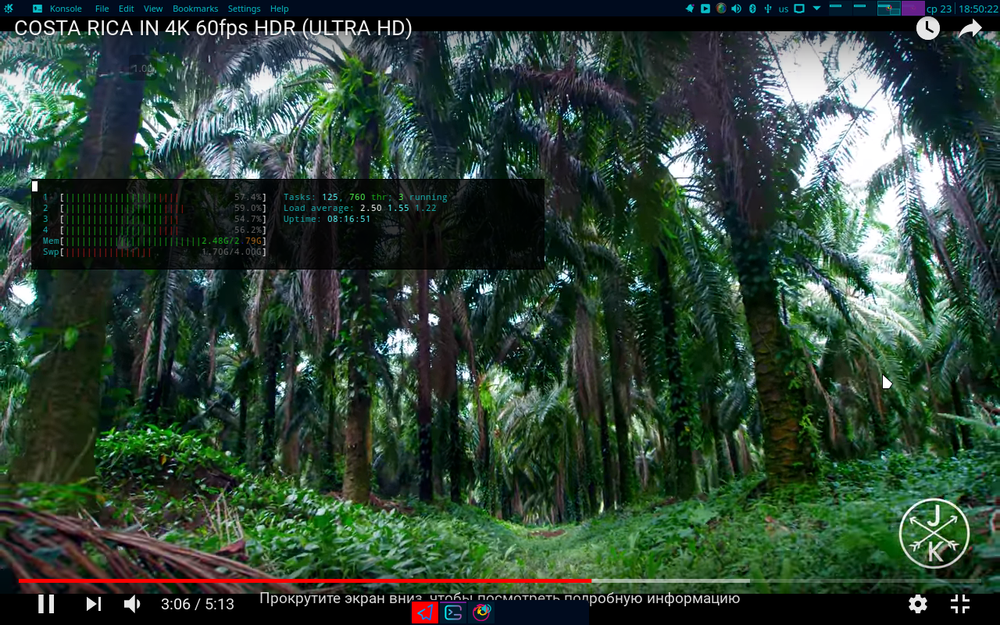
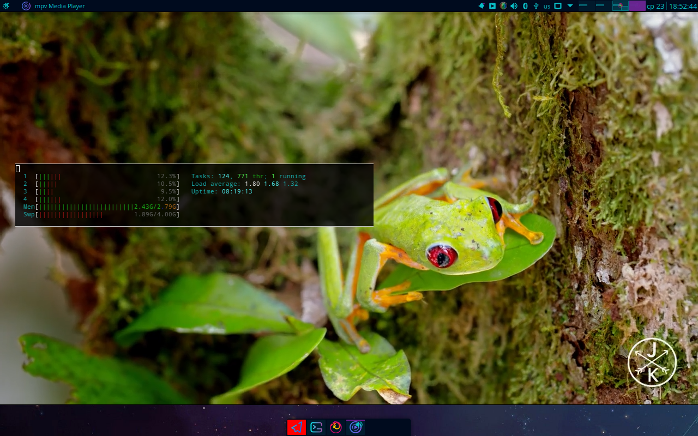

# linux
 open youtube videos as Picture In Picture in external videoplayer for better performance (3-5x better)

#### Teaser:
##### Firefox, youtube.com
 
##### mpv, youtube-dl
 

##### TMP:  
https://support.shotgunsoftware.com/hc/en-us/articles/219031308-How-to-launch-external-applications-using-custom-protocols-rock-instead-of-http-
